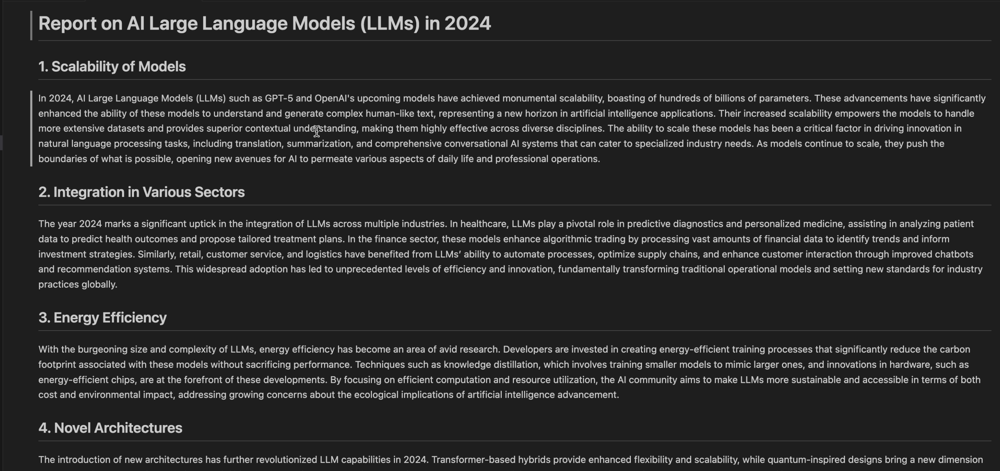
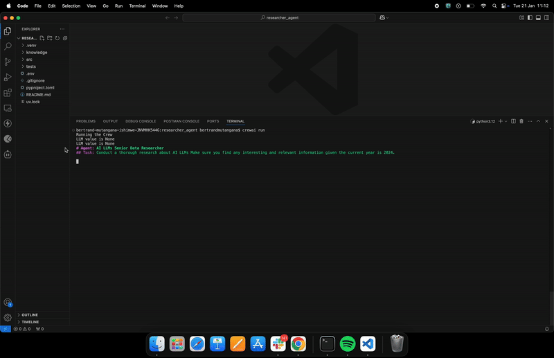

# Reporter Agent - Crewai

This is a reporter agent build with crewai. With the crewai, we are orchestrating different agents together.

## Understanding Your Crew

The Reporter-agent-crewai Crew is composed of multiple AI agents, each with unique roles, goals, and tools. These agents collaborate on a series of tasks, defined in `config/tasks.yaml`, leveraging their collective skills to achieve complex objectives. The `config/agents.yaml` file outlines the capabilities and configurations of each agent in your crew.

## Installation

Ensure you have Python >=3.10 <3.13 installed on your system. This project uses [UV](https://docs.astral.sh/uv/) for dependency management and package handling, offering a seamless setup and execution experience.

First, if you haven't already, install uv:

```bash
pip install uv
```

Next, navigate to your project directory and install the dependencies:

Lock the dependencies and install them by using the CLI command:
```bash
crewai install
```
### Customizing

**Add your `OPENAI_API_KEY` into the `.env` file**

- Modify `src/reporter_agent_crewai/config/agents.yaml` to define your agents
- Modify `src/reporter_agent_crewai/config/tasks.yaml` to define your tasks
- Modify `src/reporter_agent_crewai/crew.py` to add your own logic, tools and specific args
- Modify `src/reporter_agent_crewai/main.py` to add custom inputs for your agents and tasks

## Running the Project

To kickstart your crew of AI agents and begin task execution, run this from the root folder of your project:

```bash
crewai run
```

## Demo



This command initializes the Reporter-agent-crewai Crew, assembling the agents and assigning them tasks as defined in your configuration.

This example, unmodified, will run the create a `report.md` file with the output of a research on LLMs in the root folder.

## Support

For support, questions, or feedback regarding the ReporterAgentCrewai Crew or crewAI.
- Visit our [documentation](https://docs.crewai.com)
- Reach out to us through our [GitHub repository](https://github.com/joaomdmoura/crewai)
- [Join our Discord](https://discord.com/invite/X4JWnZnxPb)
